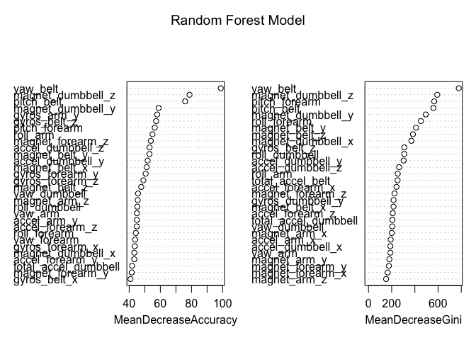

# Practical Machine Learning Project
Samir Yelne  
April 3, 2016  

##Introduction

**Using devices such as Jawbone Up, Nike FuelBand, and Fitbit it is now possible to collect a large amount of data about personal activity relatively inexpensively. These type of devices are part of the quantified self movement—a group of enthusiasts who take measurements about themselves regularly to improve their health, to find patterns in their behavior, or because they are tech geeks. One thing that people regularly do is quantify how much of a particular activity they do, but they rarely quantify how well they do it. In this project, your goal will be to use data from accelerometers on the belt, forearm, arm, and dumbell of 6 participants. They were asked to perform barbell lifts correctly and incorrectly in 5 different ways. More information is available from the website here: http://groupware.les.inf.puc-rio.br/har (see the section on the Weight Lifting Exercise Dataset).**

##Load the Data


```r
train <- read.csv("pml-training.csv",sep=",",na.strings=c("", "NA"))
test <- read.csv("pml-testing.csv",sep=",",na.strings=c("", "NA"))
```

##Clean the Data

**Once the data is loaded the next step is to clean the data. So, we need to remove all the columns with NA values and also remove the columns/features which are not present in the test data.**


```r
features <- names(test[,colSums(is.na(test))==0])[8:59]
train <- train[,c(features,"classe")]
test <- test[,c(features,"problem_id")]
```

##Bootstrap Sampling

**We can divide the data into two partition of 70% and 30% for training and testing.**


```r
library(caret)
```

```
## Loading required package: lattice
```

```
## Loading required package: ggplot2
```

```r
set.seed(1024)
inTrain <- createDataPartition(train$classe,p=0.70,list=F)
training <- train[inTrain,]
testing <- train[-inTrain,]
```

#Feature Selection

**The features which are highly correlated are dropped.**


```r
o <- which(names(training) == "classe")
hc <- findCorrelation(abs(cor(training[,-o])),0.90)
hcf <- names(training)[hc]
training <- training[,-hc]
o <- which(names(training)=="classe")
```
**The features with correlation above 0.9 are accel_belt_z, roll_belt,accel_belt_y, accel_belt_x, gyros_arm_x.**

#Building a Random Forest Model and observing the Feature Importance Plot


```r
library(randomForest)
```

```
## randomForest 4.6-12
```

```
## Type rfNews() to see new features/changes/bug fixes.
```

```
## 
## Attaching package: 'randomForest'
```

```
## The following object is masked from 'package:ggplot2':
## 
##     margin
```

```r
rf <- randomForest(classe~.,data=training,ntree=1000,importance=T)
varImpPlot(rf,main="Random Forest Model")
```



**The Feature Importance plot tells us at a glance the most important features in the model for predicting the response variable. The Mean decrease Accuracy and the Mean Decrease Gini are two index which tells us about node purity in the Random Forest Model. From the plot the features yaw_belt, magnet_dumbbell_z, pitch_belt, pitch_forearm, magnet_dumbbell_y are some of the top features for predicting the "classe" variable.**

#Building a KNN Model 


```r
library(caret)
cknn <- trainControl(method="adaptive_cv")
knn <- train(classe~.,training,method="knn",trControl=cknn)
```

#Comparing Random Forest and KNN Model on the testing data based on Confusion Matrix 

```r
fitrf <- predict(rf,testing)
confusionMatrix(fitrf,testing$classe)
```

```
## Confusion Matrix and Statistics
## 
##           Reference
## Prediction    A    B    C    D    E
##          A 1672    6    0    0    0
##          B    2 1132    9    0    0
##          C    0    1 1017   14    1
##          D    0    0    0  948    0
##          E    0    0    0    2 1081
## 
## Overall Statistics
##                                           
##                Accuracy : 0.9941          
##                  95% CI : (0.9917, 0.9959)
##     No Information Rate : 0.2845          
##     P-Value [Acc > NIR] : < 2.2e-16       
##                                           
##                   Kappa : 0.9925          
##  Mcnemar's Test P-Value : NA              
## 
## Statistics by Class:
## 
##                      Class: A Class: B Class: C Class: D Class: E
## Sensitivity            0.9988   0.9939   0.9912   0.9834   0.9991
## Specificity            0.9986   0.9977   0.9967   1.0000   0.9996
## Pos Pred Value         0.9964   0.9904   0.9845   1.0000   0.9982
## Neg Pred Value         0.9995   0.9985   0.9981   0.9968   0.9998
## Prevalence             0.2845   0.1935   0.1743   0.1638   0.1839
## Detection Rate         0.2841   0.1924   0.1728   0.1611   0.1837
## Detection Prevalence   0.2851   0.1942   0.1755   0.1611   0.1840
## Balanced Accuracy      0.9987   0.9958   0.9940   0.9917   0.9993
```


```r
fitknn <- predict(knn,testing)
confusionMatrix(fitknn,testing$class)
```

```
## Confusion Matrix and Statistics
## 
##           Reference
## Prediction    A    B    C    D    E
##          A 1591   52   10    5   16
##          B   22  979   31    9   47
##          C   23   39  948   66   37
##          D   33   35   23  867   42
##          E    5   34   14   17  940
## 
## Overall Statistics
##                                           
##                Accuracy : 0.9048          
##                  95% CI : (0.8971, 0.9122)
##     No Information Rate : 0.2845          
##     P-Value [Acc > NIR] : < 2.2e-16       
##                                           
##                   Kappa : 0.8797          
##  Mcnemar's Test P-Value : < 2.2e-16       
## 
## Statistics by Class:
## 
##                      Class: A Class: B Class: C Class: D Class: E
## Sensitivity            0.9504   0.8595   0.9240   0.8994   0.8688
## Specificity            0.9803   0.9770   0.9660   0.9730   0.9854
## Pos Pred Value         0.9504   0.8998   0.8518   0.8670   0.9307
## Neg Pred Value         0.9803   0.9666   0.9837   0.9801   0.9709
## Prevalence             0.2845   0.1935   0.1743   0.1638   0.1839
## Detection Rate         0.2703   0.1664   0.1611   0.1473   0.1597
## Detection Prevalence   0.2845   0.1849   0.1891   0.1699   0.1716
## Balanced Accuracy      0.9654   0.9183   0.9450   0.9362   0.9271
```

**Thus from the above Confusion Matrix for Random Forest and Knn Model the Random Forest Model performs better based on Accuracy, Kappa Value, Sensitivity, Specificity, Positive and Negative Predictive Value and Balanced Accuracy.** 

**Lastly I use the Random Forest Model to predict on the 20 cases submitted to coursera**


```
##  1  2  3  4  5  6  7  8  9 10 11 12 13 14 15 16 17 18 19 20 
##  B  A  B  A  A  E  D  B  A  A  B  C  B  A  E  E  A  B  B  B 
## Levels: A B C D E
```


